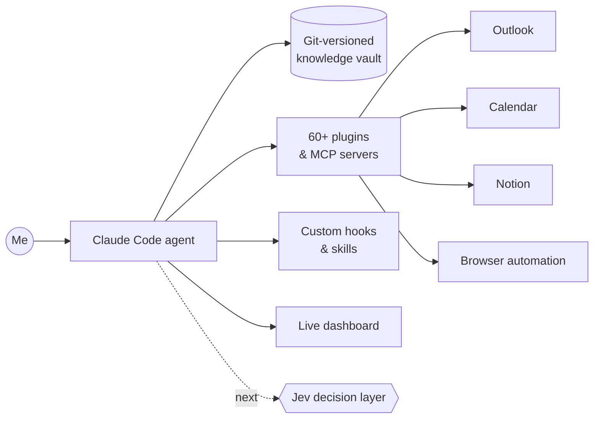

# Basma Abouzied

**I build a personal AI operating system on Claude Code: an agent with memory, rules and custom skills, wired into my email, calendar, notes and browser.**

---

## ⭐ Featured

### [claude-chief-of-staff](https://github.com/BasmaAbouzied0/claude-chief-of-staff)
Turn Claude Code into a personal chief of staff: persistent memory in an Obsidian vault, a boot routine, and hard rules that stop the classic agent mistakes. The open version of the system I run my own work on.

## ⚡ The system I run on

## ✅ Shipped

| Project | Why it matters |
|---|---|
| **[Chief-of-staff starter](https://github.com/BasmaAbouzied0/claude-chief-of-staff)** | Open-source kit that gives any Claude Code user a persistent, rule-bound agent in 10 minutes |
| **Personal AI agent** | Persistent memory, a fixed startup routine, rules it can't break, and skills written in my own voice. It boots as the same colleague every session |
| **Data dashboard** | A Python pipeline turns spreadsheets into one self-contained app built from a templated design system |
| **Knowledge vault** | Linked notes and daily logs under git. The agent reads it on boot and writes back to it |
| **Workflow skills** | Reusable agent skills that draft, format and send recurring emails exactly to spec |
| **Study engine** | Turns raw source material into structured exam study documents |

## 🔨 Building now
- **Jev decision layer** : sub-second typed checks inside my agent for routing, triage and compliance gates
- **Open-sourcing my skills** : the reusable ones, stripped of anything personal

## 📚 Learning log
- [x] Claude Code hooks, skills and plugins
- [x] MCP servers: connecting an agent to real tools
- [x] Python data pipelines for dashboards
- [x] Shipping open source on GitHub
- [ ] Jev typed decisions (Choice, Score, yes/no)
- [ ] GitHub Actions for self-updating content

## 🛠 Stack
`Claude Code` `MCP` `Python` `JavaScript` `HTML/CSS` `Git` `Obsidian` `Notion`
